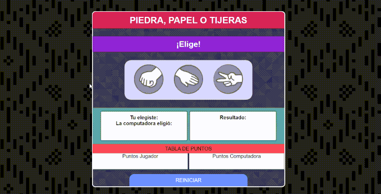

# Piedra-Papel-Tijeras
Juego "Piedra, Papel o Tijeras", ideal para poner en practica las condicionales

## Probar app : https://johanjimenex.github.io/Piedra-Papel-Tijeras/

### Vista previa




`html`
``` html
<!DOCTYPE html>
<html lang="es">

<head>
	<meta charset="UTF-8">
	<link rel="icon" href="/img/iconppt.png">
	<title>Juego: Piedra, Papel o Tijeras</title>
	<link rel="stylesheet" type="text/css" href="css/reset.css">
	<link rel="stylesheet" type="text/css" href="css/estilos.css">
</head>

<body>

	<div id="contenedor">

		<h1>PIEDRA, PAPEL O TIJERAS</h1>
		<h2>¡Elige!</h2>
		<div id="menu">
			<div id="piedra" onclick='comparar("Piedra")'></div>
			<div id="papel" onclick='comparar("Papel")'></div>
			<div id="tijeras" onclick='comparar("Tijeras")'></div>
		</div>

		<div id="contenedor2">
			<div id="colIzq">

				<div><b> Tu elegiste:</b></div>
				<span id="mostrarUsu"></span>

				<div><b>La computadora eligió:</b></div>
				<div id="mostrarCpu"></div>

			</div>

			<div id="colDer">

				<span><b>Resultado:</b></span>
				<div id="resultado"></div>

			</div>

		</div>

		<div id="tablaP">
			<div id="titulo">TABLA DE PUNTOS</div>
			<div class="col">
				<div>Puntos Jugador</div>
				<div id="puntosJugador"></div>
			</div>
			<div class="col">
				<div>Puntos Computadora</div>
				<div id="puntosCPU"></div>
			</div>
		</div>

		<!-- Llama a la funcion reinicio desde el javascript -->
		<div id="reiniciar" onclick="reinicio()">REINICIAR</div>

	</div>

	<script type="text/javascript" src="js/javascript.js"></script>
</body>

</html>
```

`javascript`
``` javascript
//Variables para almacenar los puntos ganados
var ptosJ1 = 0;
var ptosCpu = 0;

//Variables con mensajes para mostrar
var msjGana = "Ganaste!";
var msjPierde = "Perdiste!";
var msjEmpate = "Es un empate!";

var resultado = document.querySelector("#resultado");

//Funcion llamada desde el HTML con el metodo onclick(parametro) pasando como parametro la eleccion predispuesta desde el html
function comparar(eleccionJugador) {

	//Asignacion de un numero aleatorio con el metodo Math.ramdon()
	var eleccionCPU = Math.random();

	if (eleccionCPU < 0.33) {
		eleccionCPU = "Piedra";
	} else if (eleccionCPU < 0.66) {
		eleccionCPU = "Papel";
	} else {
		eleccionCPU = "Tijeras";
	}

	//Muestra elecciones tomadas
	document.getElementById("mostrarUsu").innerHTML = eleccionJugador;
	document.getElementById("mostrarCpu").innerHTML = eleccionCPU;

	//Se realiza la comparacion
	if (eleccionJugador == eleccionCPU) {
		resultado.innerHTML = msjEmpate;

	} else if (eleccionJugador == "Piedra" && eleccionCPU == "Papel") {
		resultado.innerHTML = msjPierde;
		ptosCpu++

	} else if (eleccionJugador == "Piedra" && eleccionCPU == "Tijeras") {
		resultado.innerHTML = msjGana;
		ptosJ1++

	} else if (eleccionJugador == "Papel" && eleccionCPU == "Piedra") {
		resultado.innerHTML = msjGana;
		ptosJ1++

	} else if (eleccionJugador == "Papel" && eleccionCPU == "Tijeras") {
		resultado.innerHTML = msjPierde;
		ptosCpu++

	} else if (eleccionJugador == "Tijeras" && eleccionCPU == "Piedra") {
		resultado.innerHTML = msjPierde;
		ptosCpu++

	} else if (eleccionJugador == "Tijeras" && eleccionCPU == "Papel") {
		resultado.innerHTML = msjGana;
		ptosJ1++

	}

	//Esta funcion es llamada despues de hacer las comparaciones, la misma es para actualizar puntos acumulados en el html
	actualizarTablaPtos();

}

//Esta funcion es llamada despues de hacer las comparaciones, la misma es para actualizar puntos acumulados en el html
function actualizarTablaPtos() {

	document.querySelector("#puntosJugador").innerHTML = ptosJ1;
	document.querySelector("#puntosCPU").innerHTML = ptosCpu;
}

//Funcion que recarga la pagina
function reinicio() {
	location.reload()
}


```